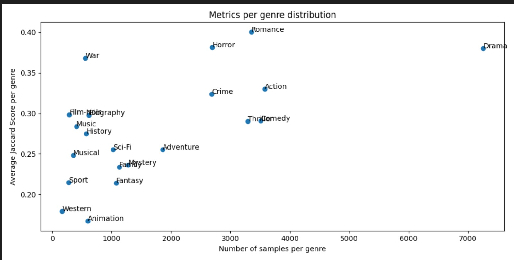

# Results and Insights
We trained a multitude of different clasifiers in combination with different text modelling approaches. The goal was to find common pitfalls an patterns all classifiers are strunggling with and to determine tasks based on these insights.

First, the quantitative results are presented as an overview of the classifiers and then insights into the dataset itself are presented. Note that the models were trained on the small dev set, as computing power was a limited resources. Further, 5-fold CV was used to get predictions on all samples in the test set. 

## Quantitative results

| Classifier          | Model        | Jaccard | At least one | Precision | Recall|
|---------------------|--------------|---------|--------------|-----------| -------| 
| Logistic Regression | Word2Vec     | 0.3156  | 0.6306       | 0.5783    | 0.3406
| Logistic Regression | Bag of Words | 0.3448  | 0.6821       | 0.5540    | 0.4097 
| Logistic Regression | tf-idf       | 0.3161  | 0.6299       | 0.5951    | 0.3317 
| KNN                 | Bag of Words | 0.1848  | 0.4688       | 0.3242    | 0.250 
| KNN                 | tf-idf       | 0.2888  | 0.6197       | 0.4663    | 0.3607 
| SVM                 | Bag of Words | 0.2401  | 0.7726       | 0.4399    | 0.563
| SVM                 | tf-idf       | ------- | -------      | -------   |

TODO: write something about results, like high recall for SVM but lower precision

## Quantitative results
Further, we compared the "good" predictions with "bad" predictions based on the jaccard score. To give a better overview we include plots about the genre occurance as well as a co-occurance matrix, to give a overview of the class distribution.

  
  

Taking a look at the two plots above one can see that we tend to have some strong class imbalance towards the Drama-genre. Additionally, this genre tends to occur quite often with other genres. 
We focus further analysis on the classifier with the highest jaccard score, that is the logistic regression with bag of words. 

The main analysis is done for the logistic regression model as it is the best performing non-DL model and also quite interpretable. 

Generally, we found that the model looks for certain distinct key words in the plots, like FUTURE in Sci-Fi. If these certain highly weighted words are present in the description, the model tends to nearly always predict this class. 

This behaviour however, is also the main pitfall of the model, as we tend to have strong overlap between genres (especially Drama) which then confuses the model. If these distinct keywords are missing, the model usually default back to the majority class, which is Drama. Note that we also use a "predict at least one approach", thats why Drama is predicted most often if the model is unsure.

Lastly, there are some samples where the ground truth labels are not quite fitting, or the "border" between certain genres is not very clear. In our opinion, even humans would argue on these annotations.

### Bad examples
Below, some wrongly predicted samples can be seen. 

* "victimize teenager chase by death have to make tough decision to hide  survive and strengthen her future . "Labels
  * Labels: ['Thriller']
  * Predicted ['Action', 'Sci-Fi']
  * Note: here, the model detects the "Future" key-word, and therefor predicting Sci-Fi

* in a excavation in Saudi Arabia professor Albert Wombot discover a ancient object of mysterious origin and hide within be a powerful secret . after his discovery the professor be brutally murder and the secret of his mysterious object seem lose forever . Sean Barrister  a former protégé of the late professor  find himself struggle to hold a job in the aftermath of the dot com bust . one evening  shortly after the murder of the professor  Sean meet a beautiful woman name Christine who seem strangely attract to he . the very same evening Sean be also approach by a man name Miklos  who be interested in hire Sean to help he find the object that the professor have discover . Sean find himself compel by _ Miklos "s" offer and begin a journey into the last day of the _ professor "s" life . follow the clue leave behind Sean  _ Miklo "s"  and Christine forge a unlikely team try to discover the secret of the hide object . but what Sean do not know be that _ Miklo "s" have a dark secret of his own  he be a vampire  and his journey through immortality lie in the hand of Sean and the discovery of the professor secret .
  * LAbels ['Horror']
  * Predicted ['Mistery']
  * Note: both seem fitting, as the line between Horror and Mistery is quite small. Also those two tend to co occur at least quite some time

* "Trackhouse : get ready chronicle the launch of one of _ NASCAR ""s"" new organization .",
  * Labels: ['Sport']
  * Predicted: ['Drama']
  * Note: here, a clear keyword for sport is missing

* a fail graduate student be at a loss when face the realistic prospect . because of all kind of experience  he choose to take the postgraduate entrance examination and finally succeed in it .,
  * Labels: ['Biography']
  * Predicted: ['Comedy', 'Romance']
  * Note: again, keywords missing and . Also, it would be really hard for humans to actually determine if its a Biography

### Good Example:
* a pink / roman porno with a yakuza character or two .
  * Label: ['Action', 'Crime']
  * Predicted: ['Action', 'Crime']
  * Note: here, "yakuza" is a very strong key word for Crime and Action 

* "the kidnap and murder of a innocent child lead agent Julián Carrera "" Valentín Trujillo "" and Roberto Rojas to investigate a organization lead by Antonio Farcas and the ruthless Albina who engage in organ trafficking and drug .",
  * Label: "['Action', 'Crime', 'Thriller']",
  * Predicted: "['Action', 'Crime', 'Thriller']"
  * Note: again, keywords

### Impossible Examples

* the story of the highwayman and folk hero  Juraj Janosik .
  * Label: ['Animation']
  * Predicted: ['Drama']
  * Note: Just from the description its impossible to say if its an animated movie, as this is a "visual" feature. Therefor, the Animation genre will always have issues, unless its explicitly stated in the description.

Also, some "ground truth labels" seem not to fit the plot very well

### Supportive Plots
In the plot below, one can see that there is a correlation between the average jaccard score and the amount of samples per label. This shows that the class imbalance has a strong effect on the performance.

  

