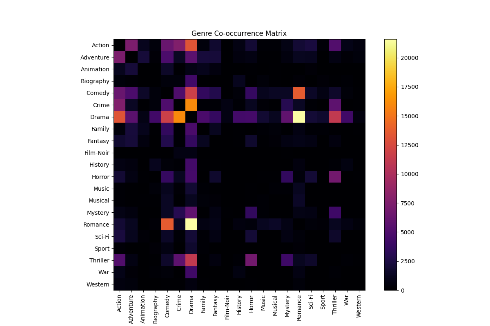
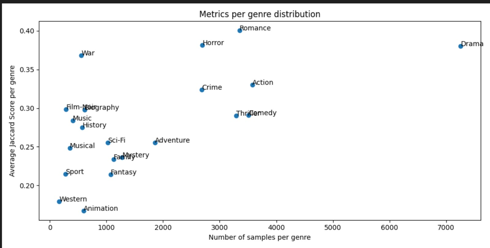

# Results and Insights
We trained a multitude of different clasifiers in combination with different text modelling approaches. The goal was to find common pitfalls and patterns all classifiers are strunggling with and to determine tasks based on these insights.

First, the quantitative results are presented as an overview of the classifiers and then insights into the dataset itself are presented. Note that the models were trained on the small dev set, as computing power was a limited resources. Further, 5-fold CV was used to get predictions on all samples in the test set. 

## Quantitative results

| Classifier          | Model        | Jaccard | At least one | Precision | Recall|
|---------------------|--------------|---------|--------------|-----------| -------| 
| Logistic Regression | Word2Vec     | 0.3156  | 0.6306       | 0.5783    | 0.3406
| Logistic Regression | Bag of Words | 0.3448  | 0.6821       | 0.5540    | 0.4097 
| Logistic Regression | tf-idf       | 0.3161  | 0.6299       | 0.5951    | 0.3317 
| KNN                 | Bag of Words | 0.1848  | 0.4688       | 0.3242    | 0.250 
| KNN                 | tf-idf       | 0.2888  | 0.6197       | 0.4663    | 0.3607 
| SVM                 | Bag of Words | 0.2401  | 0.7726       | 0.4399    | 0.563 
| SVM                 | tf-idf       | ------- | -------      | -------   | -------

The results indicate that the SVM classifier has a high recall but lower precision, suggesting it is good at identifying relevant instances but also includes more false positives. Logistic Regression with Bag of Words shows a balanced performance with the highest Jaccard score among non-DL models.

## Quantitative results
Further, we compared the "good" predictions with "bad" predictions based on the jaccard score. To give a better overview we include plots about the genre occurance as well as a co-occurance matrix, to give a overview of the class distribution.

  
  

Taking a look at the two plots above one can see that we tend to have some strong class imbalance towards the Drama genre. Additionally, this genre tends to occur quite often with other genres. 
We focus further analysis on the logistic regression with bag-of-words classifier, as it has the highest Jaccard score and is the best performing non-DL model, additionally it is quite interpretable.

Generally, we found that the model looks for certain distinct keywords in the plots, like "Future" in Sci-Fi. If these certain highly weighted words are present in the description, the model tends to nearly always predict this class. 

This behaviour however, is also the main pitfall of the model, as we tend to have strong overlap between genres (especially Drama) which then confuses the model. If these distinct keywords are missing, the model usually defaults back to the majority class, which is Drama. Note that we also use a "predict at least one" approach, thats why Drama is predicted most often if the model is unsure.

Lastly, there are some samples where the ground truth labels are not quite fitting, or the "border" between certain genres is not very clear. In our opinion, even humans would argue on these annotations.

### Bad examples:
Below, some wrongly predicted samples can be seen. 

* *"Victimized teenager chased by death has to make tough decisions to hide, survive and strengthen her future."*
  * **Labels**: ['Thriller']
  * **Predicted**: ['Action', 'Sci-Fi']
  * **Note**: Here, the model detects the ["future"](/images/feature_importance_Sci-Fi.png) keyword, and therefore predicting Sci-Fi.

* *"In an excavation in Saudi Arabia, professor Albert Wombot discovers an ancient object of mysterious origins, and hidden within is a powerful secret. After his discovery the professor is brutally murdered and the secret of his mysterious object seems lost forever. [...] But what Sean does not know is that Miklo's has a dark secret of his own, he is a vampire, and his journey through immortality lies in the hands of Sean and the discovery of the professors secret."*
  * **Labels**: ['Horror']
  * **Predicted**: ['Mystery']
  * **Note**: Both predictions seem reasonable, as the distinction between Horror and Mystery is subtle. These genres often co-occur, and the keyword "mysterious" is present in the description.

* *"The adventure of a female reporter in the 1890s."*
  * **Labels**: ['Romance']
  * **Predicted**: ['Adventure']
  * **Note**: This is a good example of a very short description missing essential context, containing a single word fitting very well into another genre.

* *"Trackhouse: Get Ready chronicles the launch of one of NASCAR's newest organizations."*
  * **Labels**: ['Sport']
  * **Predicted**: ['Drama']
  * **Note**: Here, a clear keyword for sport is missing. The model then defaults to the majority class, Drama.

* *"A failed graduate student is at a loss when facing the realistic prospect. Because of all kinds of experiences, he chooses to take the postgraduate entrance examination and finally succeeds in it."*
  * **Labels**: ['Biography']
  * **Predicted**: ['Comedy', 'Romance']
  * **Note**: Again, keywords are missing. Additionally, it would be challenging even for a human to determine if it is a Biography.

### Good Examples:
* *"A pink/roman porno with a yakuza character or two."*
  * **Labels**: ['Action', 'Crime']
  * **Predicted**: ['Action', 'Crime']
  * **Note**: Here, ["yakuza"](/images/feature_importance_Crime.png) is a very strong keyword for Crime and Action. 

* *"The kidnapping and murder of an innocent child leads agents Julián Carrera ""Valentín Trujillo"" and Roberto Rojas to investigate an organization led by Antonio Farcas and the ruthless Albina who engage in organ trafficking and drugs."*
  * **Labels**: ['Action', 'Crime', 'Thriller'],
  * **Predicted**: ['Action', 'Crime', 'Thriller']
  * **Note**: Again, keywords.

### Impossible Examples

* *"The story of the highwayman and folk hero, Juraj Janosik."*
  * **Labels**: ['Animation']
  * **Predicted**: ['Drama']
  * **Note**: Just from the description its impossible to say if its an animated movie, as this is a "visual" feature. Therefore, the Animation genre will always have issues, unless its explicitly stated in the description. 

**Additionally, some ground truth labels do not seem to match the plot accurately, for example:**

* *"In 2030 during World War III, a small group of survivors make it into a bunker. Two years later, they have to exit to find new supplies but are greeted by dinosaur predators."*
  * **Labels**: ['Adventure', 'Sci-Fi']
  * **Predicted**: ['Drama']
  * **Note**: It is strange that keywords like "War", "survivors", and "bunker" did not trigger the war classifier. Additionally, it was not even labeled as War to begin with.

### Supportive Plots
In the plot below, one can see that there is a correlation between the average jaccard score and the amount of samples per label. This shows that the class imbalance has a strong effect on the performance.

  

Also, please refer to the feature importance plots in the [images](/images) folder. These are the words scaled by the repective learned weights of the logistic regression classifier.