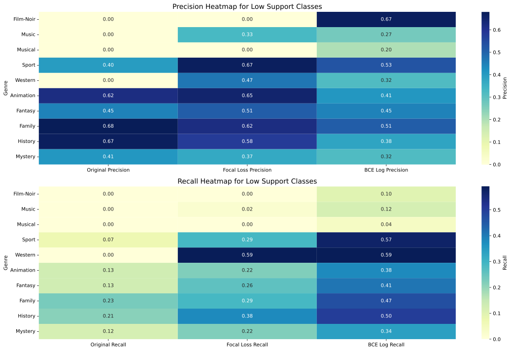
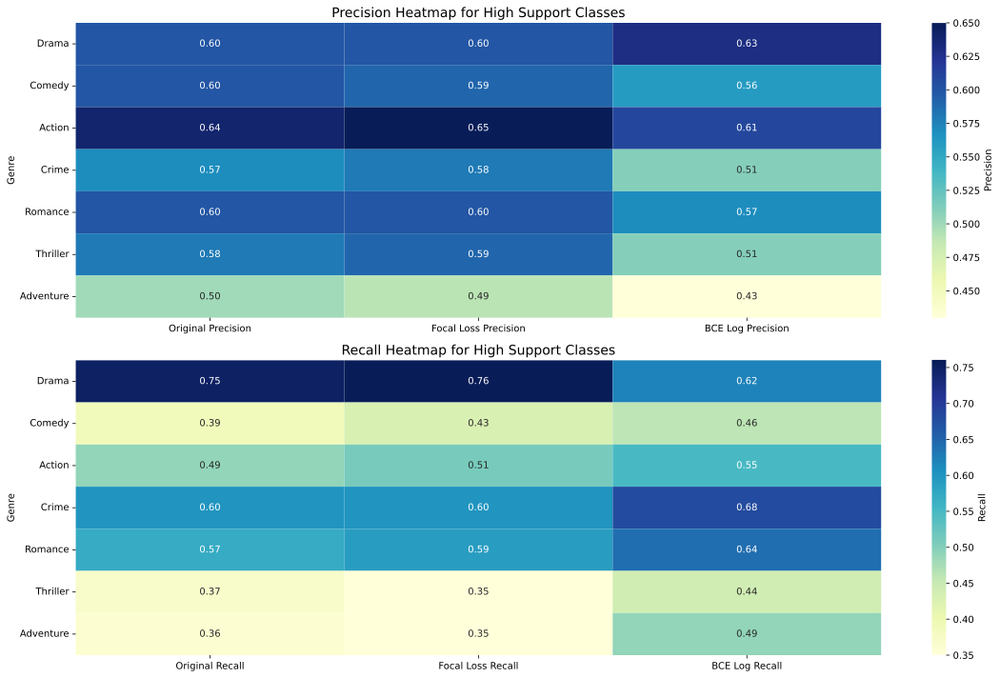

# README

## Dataset Creation Process

The dataset was initially sourced from **Kaggle** (link below). Since the data was divided into multiple `.csv` files by genre, these files were merged into a single dataset. After merging, data analysis and cleaning were conducted to address some detected issues. Over 70k rows had incomplete **descriptions** ("See full summary"), while an additional 50k entries were missing descriptions ("Add a plot"). Missing data was subsequently retrieved via the IMDb API and saved in `crawl_data.csv`, then merged with the original dataset and further cleaned, resulting in `clean_data.csv`. Standard preprocessing steps were then applied, and the finalized dataset was saved in **CoNLL-U** format (`conllu_data.conllu`).

## Downloading the Files

To automate the download process, run the following:
```bash
python src/download.py
```

Alternatively, create a `data/` folder manually. Inside `data/`, create a `raw/` folder, where you should copy and extract the `.csv` files downloaded from [Kaggle](https://www.kaggle.com/datasets/rajugc/imdb-movies-dataset-based-on-genre?select=history.csv).

Next, download `crawl_data.csv` (or optionally `clean_data.csv`) from the links below and place it in the `data/` folder:

| File Name           | URL                                                 | Purpose                             |
|---------------------|-----------------------------------------------------|-------------------------------------|
| crawl_data.csv      | [https://drive.google.com/uc?id=1HAARdniVyolwvwfYjhXTy5EUzd9kYSkE](https://drive.google.com/uc?id=1HAARdniVyolwvwfYjhXTy5EUzd9kYSkE) | Data crawled via the IMDb API.
| clean_data.csv      | [https://drive.google.com/uc?id=12pSL_4PxiyqGTQm8mfomHGEbB3Il1yZG](https://drive.google.com/uc?id=12pSL_4PxiyqGTQm8mfomHGEbB3Il1yZG) | Data after merging with crawled data and cleaning.
| conllu_data.conllu  | [https://drive.google.com/uc?id=1cyjpL7dXFr_2WhLIlbNPO-PyHeEZBpHI](https://drive.google.com/uc?id=1cyjpL7dXFr_2WhLIlbNPO-PyHeEZBpHI) | Preprocessed data in a CoNLL-U format.


## Folder Structure

- `src/`: Contains all scripts.
- `plot/`: Contains all generated plots from data analysis.

## Running the Code

To execute the main script, use:
```bash
python src/main.py
```

All functions are run through `main.py` and configured by the `config.json` file with the following options:

* `--tokenize`: Performs tokenization and lemmatization.
* `--preprocess`: Loads and cleans raw data.
* `--explore`: Enables data exploration (options: raw or clean).
* `--store_intermediate`: Saves intermediate files for data crawling.
* `--verbose`: Enables logging.
* `--predict`: Enables model prediction.
* `--evaluate`: Evaluates the model performance.

# Movie Genre Classification

This repository contains the implementation of models to classify movie genres based on their descriptions. The task is a multi-label, multi-class classification problem where a movie can belong to multiple genres.

## Models Overview

### Non-Deep Learning Model(s)
*(To be completed)*

### Deep Learning Model

#### Model Architecture
We utilized **DistilBERT**, a distilled and compact version of BERT, as the backbone for this task. DistilBERT was chosen for its:  
- Faster training and inference times compared to BERT.  
- Compact size while retaining a significant portion of BERT’s performance.

#### Key Strategies

1. **Ensuring Predictions for All Movies:**  
   - Implemented logic to ensure at least one genre is predicted for each movie by assigning the genre with the highest probability when no positive class is predicted.

2. **Addressing Class Imbalance:**  
   - **Class Weights**: Used `np.log(total_samples / (class_counts + 1))`, normalized by their mean, in conjunction with ***BCEWithLogitsLoss***.
   - **Focal Loss:** Incorporated to focus on underrepresented genres, achieving the best validation performance. Constants `alpha` and `gamma` were set to **0.375** and **2.00**, respectively.
   - **Oversampling:** Opportunity to explore oversampling techniques like **SMOTE** to address class imbalance for Milestone 3.  

   While these techniques did not dramatically increase the overall performance of the model, they were effective in improving predictions for low-support classes such as *Music*, *Musical*, *Sport*, *Film-Noir*, and *Western*.

3. **Training:**  
   - All models were trained for 3 epochs on a smaller development dataset of ~17k rows (0.8/0.1/0.1 split).  
   - Achieved a Jaccard score of approximately **0.43**.  

---

### Combined Metrics

|     **Metric**    | **Original** | **Focal Loss** | **Log Weighted BCE** |
|:-------------------:|:--------------:|:----------------:|:----------------------:|
| **Jaccard**           | 0.42         | 0.44           | 0.43                 |
| **Hamming Loss**      | 0.09         | 0.09           | 0.09                 |
| **Accuracy**          | 0.14         | 0.15           | 0.14                 |
| **F1-Score**          | 0.52         | 0.54           | 0.54                 |
| **Precision**         | 0.63         | 0.63           | 0.58                 |
| **Recall**            | 0.50         | 0.53           | 0.56                 |
| **At Least One**      | 0.80         | 0.81           | 0.83                 |
| **At Least Two**      | 0.25         | 0.28           | 0.33                 |

---

### Classification Report (Original)

| **Genre**         | **Precision** | **Recall** | **F1-Score** | **Support** |
|-------------------|---------------|------------|--------------|-------------|
| Action            | 0.64          | 0.49       | 0.55         | 358.0       |
| Adventure         | 0.50          | 0.36       | 0.42         | 185.0       |
| Animation         | 0.62          | 0.13       | 0.22         | 60.0        |
| Biography         | 0.68          | 0.27       | 0.39         | 62.0        |
| Comedy            | 0.60          | 0.39       | 0.47         | 371.0       |
| Crime             | 0.57          | 0.60       | 0.59         | 282.0       |
| Drama             | 0.60          | 0.75       | 0.67         | 728.0       |
| Family            | 0.68          | 0.23       | 0.34         | 113.0       |
| Fantasy           | 0.45          | 0.13       | 0.20         | 107.0       |
| Film-Noir         | 0.00          | 0.00       | 0.00         | 40.0        |
| History           | 0.67          | 0.21       | 0.32         | 58.0        |
| Horror            | 0.76          | 0.70       | 0.73         | 269.0       |
| Music             | 0.00          | 0.00       | 0.00         | 59.0        |
| Musical           | 0.00          | 0.00       | 0.00         | 48.0        |
| Mystery           | 0.41          | 0.12       | 0.19         | 128.0       |
| Romance           | 0.60          | 0.57       | 0.58         | 335.0       |
| Sci-Fi            | 0.78          | 0.51       | 0.62         | 102.0       |
| Sport             | 0.40          | 0.07       | 0.12         | 28.0        |
| Thriller          | 0.58          | 0.37       | 0.45         | 329.0       |
| War               | 0.70          | 0.37       | 0.48         | 57.0        |
| Western           | 0.00          | 0.00       | 0.00         | 17.0        | 


### Micro, Macro, Weighted, and Samples Average

| Precision       | Original | Focal Loss | BCE Log |
|---------------- |----------|------------|---------|
| **Micro Avg**   | 0.61     | 0.61       | 0.55    |
| **Macro Avg**   | 0.49     | 0.53       | 0.49    |
| **Weighted Avg**| 0.58     | 0.59       | 0.55    |
| **Samples Avg** | 0.63     | 0.63       | 0.58    |

| Recall          | Original | Focal Loss | BCE Log |
|---------------- |----------|------------|---------|
| **Micro Avg**   | 0.47     | 0.50       | 0.54    |
| **Macro Avg**   | 0.30     | 0.37       | 0.47    |
| **Weighted Avg**| 0.47     | 0.50       | 0.54    |
| **Samples Avg** | 0.50     | 0.52       | 0.56    |

### Performance Summary

- **Precision** is higher in the **Original** and **Focal Loss** models, as they focus more on reducing false positives, especially in larger, more balanced genres. **Focal Loss** further boosts precision by prioritizing harder-to-classify examples.

- **Recall** is better in the **BCE Log** model due to the class weights it applies, which help it focus on underrepresented genres. This allows it to capture more true positives, especially in low-support genres like **Film-Noir**.

- **F1-Score** is generally higher in **Original** and **Focal Loss** models, as they balance precision and recall better, while **BCE Log** performs well in low-support genres by boosting recall.

### Genre-Specific Notes
Genres like **Film-Noir** have low support, which leads to challenges in classifying them. **BCE Log** improves recall for these genres by applying class weights, though at the cost of precision, which we cant see in the [first set of heat maps](#low-support-genres). The **Original** and **Focal Loss** models perform better for larger genres with more balanced classes, can be observed in the [second set of heat maps](#high-support-genres).


<h4 id="low-support-genres">Performance Heatmap for Low-Support Genres </h4>


Recall dramatically higher in **BCE Log** model for low-support genres, while Focal loss keeps up in both precision and recall.

<h4 id="high-support-genres">Performance Heatmap for High-Support Genres </h4>


Differences in precision and recall are less pronounced in high-support genres, with **Original** and **Focal Loss** models performing better.
