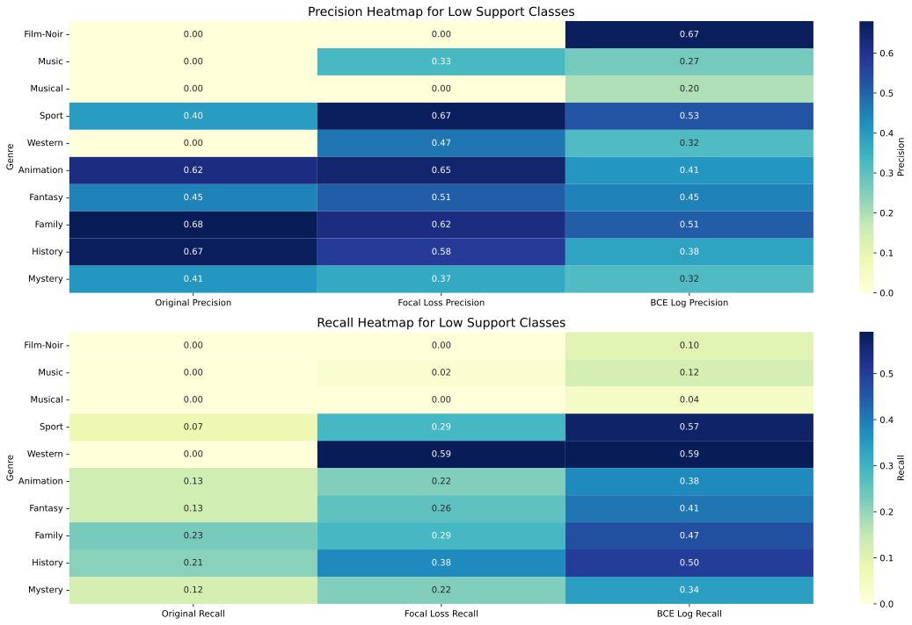

# Movie Genre Classification

This repository contains the implementation of models to classify movie genres based on their descriptions. The task is a multi-label, multi-class classification problem where a movie can belong to multiple genres.

## Dataset Creation Process

The dataset was initially sourced from **Kaggle** (link below). Since the data was divided into multiple `.csv` files by genre, these files were merged into a single dataset. After merging, data analysis and cleaning were conducted to address some detected issues. Over 70k rows had incomplete **descriptions** ("See full summary"), while an additional 50k entries were missing descriptions ("Add a plot"). Missing data was subsequently retrieved via the IMDb API and saved in `crawl_data.csv`, then merged with the original dataset and further cleaned, resulting in `clean_data.csv`. Standard preprocessing steps were then applied, and the finalized dataset was saved in **CoNLL-U** format (`conllu_data.conllu`).

## Downloading the Files

To automate the download process, run the following:
```bash
python src/download.py
```

Alternatively, create a `data/` folder manually. Inside `data/`, create a `raw/` folder, where you should copy and extract the `.csv` files downloaded from [Kaggle](https://www.kaggle.com/datasets/rajugc/imdb-movies-dataset-based-on-genre?select=history.csv).

Next, download `crawl_data.csv` (or optionally `clean_data.csv`) from the links below and place it in the `data/` folder:

| File Name           | URL                                                 | Purpose                             |
|---------------------|-----------------------------------------------------|-------------------------------------|
| crawl_data.csv      | [https://drive.google.com/uc?id=1HAARdniVyolwvwfYjhXTy5EUzd9kYSkE](https://drive.google.com/uc?id=1HAARdniVyolwvwfYjhXTy5EUzd9kYSkE) | Data crawled via the IMDb API.
| clean_data.csv      | [https://drive.google.com/uc?id=12pSL_4PxiyqGTQm8mfomHGEbB3Il1yZG](https://drive.google.com/uc?id=12pSL_4PxiyqGTQm8mfomHGEbB3Il1yZG) | Data after merging with crawled data and cleaning.
| conllu_data.conllu  | [https://drive.google.com/uc?id=1cyjpL7dXFr_2WhLIlbNPO-PyHeEZBpHI](https://drive.google.com/uc?id=1cyjpL7dXFr_2WhLIlbNPO-PyHeEZBpHI) | Preprocessed data in a CoNLL-U format.


## Folder Structure

- `src/`: Contains all scripts.
- `plot/`: Contains all generated plots from data analysis.

## Running the Code

To execute the main script, use:
```bash
python src/main.py
```

All functions are run through `main.py` and configured by the `config.json` file with the following options:

* `--tokenize`: Performs tokenization and lemmatization.
* `--preprocess`: Loads and cleans raw data.
* `--explore`: Enables data exploration (options: raw or clean).
* `--store_intermediate`: Saves intermediate files for data crawling.
* `--verbose`: Enables logging.
* `--predict`: Enables model prediction.

## Non-Deep Learning Model(s)

### Results and Insights
We trained a multitude of different clasifiers in combination with different text modelling approaches. The goal was to find common pitfalls and patterns all classifiers are strunggling with and to determine tasks based on these insights.

First, the quantitative results are presented as an overview of the classifiers and then insights into the dataset itself are presented. Note that the models were trained on the small dev set, as computing power was a limited resources. Further, 5-fold CV was used to get predictions on all samples in the test set. 


### Quantitative results

| Classifier          | Model        | Jaccard | At least one | Precision | Recall|
|---------------------|--------------|---------|--------------|-----------| -------| 
| Logistic Regression | Word2Vec     | 0.3156  | 0.6306       | 0.5783    | 0.3406
| Logistic Regression | Bag of Words | 0.3448  | 0.6821       | 0.5540    | 0.4097 
| Logistic Regression | tf-idf       | 0.3161  | 0.6299       | 0.5951    | 0.3317 
| KNN                 | Bag of Words | 0.1848  | 0.4688       | 0.3242    | 0.250 
| KNN                 | tf-idf       | 0.2888  | 0.6197       | 0.4663    | 0.3607 
| SVM                 | Bag of Words | 0.2401  | 0.7726       | 0.4399    | 0.563 
| SVM                 | tf-idf       | ------- | -------      | -------   | -------

The results indicate that the SVM classifier has a high recall but lower precision, suggesting it is good at identifying relevant instances but also includes more false positives. Logistic Regression with Bag of Words shows a balanced performance with the highest Jaccard score among non-DL models.

## Quantitative Analysis
Further, we compared the "good" predictions with "bad" predictions based on the jaccard score. To give a better overview we include plots about the genre occurance as well as a co-occurance matrix, to give a overview of the class distribution.

<p>
  
  
</p>

Taking a look at the two plots above one can see that we tend to have some strong class imbalance towards the Drama genre. Additionally, this genre tends to occur quite often with other genres. 
We focus further analysis on the logistic regression with bag-of-words classifier, as it has the highest Jaccard score and is the best performing non-DL model, additionally it is quite interpretable.

Generally, we found that the model looks for certain distinct keywords in the plots, like "Future" in Sci-Fi. If these certain highly weighted words are present in the description, the model tends to nearly always predict this class. 

This behaviour however, is also the main pitfall of the model, as we tend to have strong overlap between genres (especially Drama) which then confuses the model. If these distinct keywords are missing, the model usually defaults back to the majority class, which is Drama. Note that we also use a "predict at least one" approach, thats why Drama is predicted most often if the model is unsure.


Lastly, there are some samples where the ground truth labels are not quite fitting, or the "border" between certain genres is not very clear. In our opinion, even humans would argue on these annotations.

### Bad examples:
Below, some wrongly predicted samples can be seen. 

* *"Victimized teenager chased by death has to make tough decisions to hide, survive and strengthen her future."*
  * **Labels**: ['Thriller']
  * **Predicted**: ['Action', 'Sci-Fi']
  * **Note**: Here, the model detects the ["future"](/images/feature_importance_Sci-Fi.png) keyword, and therefore predicting Sci-Fi.


* *"In an excavation in Saudi Arabia, professor Albert Wombot discovers an ancient object of mysterious origins, and hidden within is a powerful secret. After his discovery the professor is brutally murdered and the secret of his mysterious object seems lost forever. [...] But what Sean does not know is that Miklo's has a dark secret of his own, he is a vampire, and his journey through immortality lies in the hands of Sean and the discovery of the professors secret."*
  * **Labels**: ['Horror']
  * **Predicted**: ['Mystery']
  * **Note**: Both predictions seem reasonable, as the distinction between Horror and Mystery is subtle here. These genres often co-occur, and the keyword "mysterious" is present in the description.

* *"The adventure of a female reporter in the 1890s."*
  * **Labels**: ['Romance']
  * **Predicted**: ['Adventure']
  * **Note**: This is a good example of a very short description missing essential context, containing a single word fitting very well into another genre.

* *"Trackhouse: Get Ready chronicles the launch of one of NASCAR's newest organizations."*
  * **Labels**: ['Sport']
  * **Predicted**: ['Drama']
  * **Note**: Here, a clear keyword for sport is missing. The model then defaults to the majority class, Drama.


* *"A failed graduate student is at a loss when facing the realistic prospect. Because of all kinds of experiences, he chooses to take the postgraduate entrance examination and finally succeeds in it."*
  * **Labels**: ['Biography']
  * **Predicted**: ['Comedy', 'Romance']
  * **Note**: Again, keywords are missing. Additionally, it would be challenging even for a human to determine if it is a Biography.


### Good Examples:
* *"A pink/roman porno with a yakuza character or two."*
  * **Labels**: ['Action', 'Crime']
  * **Predicted**: ['Action', 'Crime']
  * **Note**: Here, ["yakuza"](/images/feature_importance_Crime.png) is a very strong keyword for Crime and Action. 


* *"The kidnapping and murder of an innocent child leads agents Julián Carrera ""Valentín Trujillo"" and Roberto Rojas to investigate an organization led by Antonio Farcas and the ruthless Albina who engage in organ trafficking and drugs."*
  * **Labels**: ['Action', 'Crime', 'Thriller'],
  * **Predicted**: ['Action', 'Crime', 'Thriller']
  * **Note**: Again, keywords.

### Impossible Examples

* *"The story of the highwayman and folk hero, Juraj Janosik."*
  * **Labels**: ['Animation']
  * **Predicted**: ['Drama']
  * **Note**: Just from the description its impossible to say if its an animated movie, as this is a "visual" feature. Therefore, the Animation genre will always have issues, unless its explicitly stated in the description. 

**Additionally, some ground truth labels do not seem to match the plot accurately, for example:**

* *"In 2030 during World War III, a small group of survivors make it into a bunker. Two years later, they have to exit to find new supplies but are greeted by dinosaur predators."*
  * **Labels**: ['Adventure', 'Sci-Fi']
  * **Predicted**: ['Drama']
  * **Note**: It is strange that keywords like "War", "survivors", and "bunker" did not trigger the war classifier. Additionally, it was not even labeled as War to begin with.


### Supportive Plots
In the plot below, one can see that there is a correlation between the average jaccard score and the amount of samples per label. This shows that the class imbalance has a strong effect on the performance.
<p>
  
</p>

Also, please refer to the feature importance plots in the [images](/images) folder. These are the words scaled by the repective learned weights of the logistic regression classifier.

## Deep Learning Model

### Model Architecture
We utilized **DistilBERT**, a distilled and compact version of BERT, as the backbone for this task. DistilBERT was chosen for its:  
- Faster training and inference times compared to BERT.  
- Compact size while retaining a significant portion of BERT’s performance.

### Key Strategies

1. **Ensuring Predictions for All Movies:**  
   - Implemented logic to ensure at least one genre is predicted for each movie by assigning the genre with the highest probability when no positive class is predicted.

2. **Addressing Class Imbalance:**  
   - **Class Weights**: Used `np.log(total_samples / (class_counts + 1))`, normalized by their mean, in conjunction with ***BCEWithLogitsLoss***.
   - **Focal Loss:** Incorporated to focus on underrepresented genres, achieving the best validation performance. Constants `alpha` and `gamma` were set to **0.375** and **2.00**, respectively.
   - **Oversampling:** Opportunity to explore oversampling techniques like **SMOTE** to address class imbalance for Milestone 3.  

   While these techniques did not dramatically increase the overall performance of the model, they were effective in improving predictions for low-support classes such as *Music*, *Musical*, *Sport*, *Film-Noir*, and *Western* which can be seen in the [classificaiton report graphs](#classification-report-graph-original-vs-bce) (with original model being the top one, BCE below).

3. **Training:**  
   - All models were trained for 3 epochs on a smaller development dataset of ~17k rows (0.8/0.1/0.1 split).  
   - Achieved a Jaccard score of approximately **0.43**.  

---

### Combined Metrics

|     **Metric**      | **Original** | **Focal Loss** | **Log Weighted BCE** | **LogReg** |
|:-------------------:|:--------------:|:----------------:|:----------------------:|:---------:|
| **Jaccard**           | 0.42         | 0.44           | 0.43                 | 0.35      |
| **Hamming Loss**      | 0.09         | 0.09           | 0.09                 | 0.10      |
| **Accuracy**          | 0.14         | 0.15           | 0.14                 |  ----         |
| **F1-Score**          | 0.52         | 0.54           | 0.54                 | 0.48      |
| **Precision**         | 0.63         | 0.63           | 0.58                 | 0.55      |
| **Recall**            | 0.50         | 0.53           | 0.56                 | 0.42      |
| **At Least One**      | 0.80         | 0.81           | 0.83                 | 0.69      |
| **At Least Two**      | 0.25         | 0.28           | 0.33                 | 0.16      |

---

### Classification report graph (Original vs BCE)


---
### Micro, Macro, Weighted, and Samples Average

| Precision       | Original | Focal Loss | BCE Log |
|---------------- |----------|------------|---------|
| **Micro Avg**   | 0.61     | 0.61       | 0.55    |
| **Macro Avg**   | 0.49     | 0.53       | 0.49    |
| **Weighted Avg**| 0.58     | 0.59       | 0.55    |
| **Samples Avg** | 0.63     | 0.63       | 0.58    |

| Recall          | Original | Focal Loss | BCE Log |
|---------------- |----------|------------|---------|
| **Micro Avg**   | 0.47     | 0.50       | 0.54    |
| **Macro Avg**   | 0.30     | 0.37       | 0.47    |
| **Weighted Avg**| 0.47     | 0.50       | 0.54    |
| **Samples Avg** | 0.50     | 0.52       | 0.56    |

---

### Performance Summary

- **Precision** is higher in the **Original** and **Focal Loss** models, as they focus more on reducing false positives, especially in larger, more balanced genres. **Focal Loss** further boosts precision by prioritizing harder-to-classify examples.

- **Recall** is better in the **BCE Log** model due to the class weights it applies, which help it focus on underrepresented genres. This allows it to capture more true positives, especially in low-support genres like **Film-Noir**.

- **F1-Score** is generally higher in **Original** and **Focal Loss** models, as they balance precision and recall better, while **BCE Log** performs well in low-support genres by boosting recall.

### Genre-Specific Notes
Genres like **Film-Noir** have low support (while also co-occuring with majority classes), which leads to challenges in classifying them. **BCE Log** improves recall for these genres by applying class weights, though at the cost of precision (precision and recall are more balanced), which we can see in the [first set of heat maps](#low-support-genres) and also in the [classification report comparison](#classification-report-graph-original-vs-bce). The **Original** and **Focal Loss** models perform better for larger genres with more balanced classes, can be observed in the [second set of heat maps](#high-support-genres).

**Animation** and **Biography** have high precision but low recall due to class imbalance and reliance on specific keywords ("animated" for Animation, "biopic" for Biography). These genres are underrepresented, leading to the model being highly selective, resulting in fewer false positives but missing many true examples (low recall). In contrast, **Drama**, with larger support and more varied examples, benefits from label co-occurrence and overlaps with other genres, resulting in higher recall, though at the cost of lower precision. However, due to the complexity of deep learning models, other factors may also contribute.

<h3 id="low-support-genres">Performance Heatmap for Low-Support Genres </h3>


Recall dramatically higher in **BCE Log** model for low-support genres, while Focal loss keeps up in both precision and recall.

<h3 id="high-support-genres">Performance Heatmap for High-Support Genres </h3>


Differences between **BCE** and other loss functions in precision and recall are less pronounced in high-support genres, with **Original** and **Focal Loss** models performing better.

---

### Comparison with Logistic Regression


From the graphs above it seems the DL model performs better in higher support genres (e.g., Horror, Crime, Drama) because it excels
at capturing complex patterns and relationships from larger datasets, enabling better generalization.
In contrast, lower support genres (e.g., Animation, Biography, Mystery) struggle in the DL model likely due
to its need for more data to avoid overfitting, whereas logistic regression benefits from simpler
keyword-based features that perform well with small datasets.
For the War genre, even with limited data, the DL model seems to handle it better, likely due to its ability to capture the complex relationships in the genre’s themes.
## Qualitative Analysis

<!-- Examples of similiar predictions as logistic regression
story ned kelly

Examples of different (better) precitions on the same movie
war example

Other examples where the model did bad

Examples where the model did much better (accordig do jaccard score) -->

### Bad examples:

#### Common Issues of the DL Compared to Logistic Regression (Keyword Reliance and Drama Majority Bias)  
* *"A poor but big-hearted man takes orphans into his home. After discovering his scientist father's invisibility device, he rises to the occasion and fights to save his children and all of India from the clutches of a megalomaniac."*  
  * **Labels**: ['Action', 'Comedy', 'Drama']  
  * **Predicted**: ['Family']  

* *"A hobo (Julio Alemán) is given the power to know what will happen in the future, but only for 24 hours."*  
  * **Labels**: ['Drama', 'Fantasy']  
  * **Predicted**: ['Sci-Fi']  

* *"A man travels through Asia and Africa seeking the treasure of Ali Baba."*  
  * **Labels**: ['Action']  
  * **Predicted**: ['Adventure']  
* **Note**: The model appears to rely heavily on isolated keywords, such as "children" (Family), "future" (Sci-Fi), and "travels" (Adventure), while overlooking the broader context.

---

* *"The story of Eugenio, young soldier of the Napoleonic army, in the Napoli of 1815 after the era of Gioacchino Murat."*  
   * **Labels**: ['History']  
   * **Predicted**: ['Drama', 'History']  

* *"Transylvania in the Autumn of 1944, soon after Romania turned against Nazi Germany, a joint Soviet-Romanian commando group is sent across enemy lines with a mission to prevent the destruction of a strategic mountain tunnel by German troops."*  
   * **Labels**: ['War']  
   * **Predicted**: ['Drama', 'War']  

* **Note**: Both examples illustrate the model's tendency to overemphasize Drama due to its majority class status, despite the clear historical and war-specific contexts.

---

### Additional Genres Misclassified  

#### **Horror Misclassification**  

* *"The ghost of a dead porn star comes to Earth to help a nerd with his sex life."*  
  * **Labels**: ['Comedy', 'Fantasy', 'Romance']  
  * **Predicted**: ['Horror']  
  * **Note**: The word "ghost" misleads the model into choosing Horror, despite the lighthearted and comedic context.  

* *"A man suspects his wife of adultery and goes on a killing spree, eliminating all he believes are sleeping with her, but his victims don't stay dead."*  
  * **Labels**: ['Horror']  
  * **Predicted**: ['Crime', 'Drama', 'Thriller']  
  * **Note**: The absence of direct Horror keywords likely leads to misclassification into suspense-based and high-support genres.  

#### **Comedy Misclassification**  

* *"After driving too fast, A6262 jumps from the year 2037 back 50 years to 1987, where she meets and charms chocolate factory owner Fong."*  
  * **Labels**: ['Romance', 'Sci-Fi']  
  * **Predicted**: ['Comedy']  
  * **Note**: The quirky premise (chocalate factory) probably causes the model to overfit to Comedy, despite Romance and Sci-Fi being more prominent.  

* *"Cute Katya starts as a window dresser at a Pittsburgh department store. She dates a reporter. A fan stalks her and is increasingly nasty."*  
  * **Labels**: ['Thriller']  
  * **Predicted**: ['Comedy']  
  * **Note**: Misclassification arises from a lack of explicit suspense cues in the description, and Comedy's high support exacerbates the issue.  

The **Horror** genre, despite not being the most major class, performs well due to its distinct features. However, the model often mislabels it, relying on keywords like "ghost" or "killing" that overlap with other genres. This shows the model's effectiveness in identifying **Horror** but also its struggle with nuanced contexts where such keywords are present but do not define the genre.

The **Comedy** genre's broad nature leads to frequent misclassifications. The model struggles with subtle nuances, often confusing Comedy with **Romance** or **Family** if humor isn't explicit. Overlaps with genres like **Drama** or **Romance** further complicate predictions, indicating a need for better feature extraction and context understanding.

---

### Good examples:  

Here we chose examples based on the difference of scores between Logistic regression and the DL model.

* *"Inheriting a dry patch of land, Bancharam converts it into a fabulous garden."*  
  * **Labels**: ['Fantasy']  
  * **Predicted**: ['Fantasy']  
  * **Lreg**: ['Adventure']
  * **Note**: The model correctly aligns the whimsical transformation with the Fantasy genre.  

* *"After his father is killed, King Valemon ascends the throne, only to be turned into a polar bear by a bitter witch who wants to be his queen. Valemon must find a bride in the seven-year span that he'll be a polar bear, ..."*  
  * **Labels**: ['Adventure', 'Family', 'Fantasy']  
  * **Predicted**: ['Adventure', 'Family', 'Fantasy']  
  * **Lreg**: ['Horror']
  * **Note**: The DL model effectively captures the blend of genres due to the rich and explicit narrative.  

* *"Several animated stories from 'Metamorphoses,' Roman poet Ovid's narrative of legends, are presented."*  
  * **Labels**: ['Animation', 'Fantasy']  
  * **Predicted**: ['Animation', 'Fantasy']  
   * **Lreg**: ['Comedy']
  * **Note**: Correctly identifies the artistic and fantastical focus, avoiding overfitting to high-support genres like Comedy.  


* *"In 2030 during World War III in which a small group of survivors make it into a bunker. Two years later they have to exit to find new supplies, but they are greeted by dinosaur predators."*  
   * **Labels**: ['Sci-Fi', 'Adventure']  
   * **Predicted**: ['Sci-Fi']  
   * **Lreg**: ['Drama']
   * **Note**: The DL model correctly identifies the Sci-Fi genre due to the futuristic and survival elements (adventure being almost picked with the second highest prob).

---

### Impossible Cases  

* *"An adaptation of the homonym Pere Calders' work, a history full of other histories, centered in the reunion of his protagonist's first love."*  
  * **Labels**: ['Horror']  
  * **Predicted**: ['Drama', 'Romance']  
  * **Note**: The title ("La Veritat Oculta") is crucial context here; without it, the prediction is understandably incorrect.  

* *"Lance Hayward, a silent movie star, appears as various characters, killing quite a handful of unfortunates, using various weapons."*  
  * **Labels**: ['Horror']
  * **Predicted**: ['Action'] 
  * **Note**: The title ("Terror Night") would provide the missing Horror signal.  

---  

These examples highlight model strengths in handling explicit genre cues but also its overreliance on single keywords or majority class bias when context is insufficient.

## Summary of Findings
While the DL model performs better overall, it is still heavily influenced by class imbalances, primarily due to the prevalence of the Drama genre. This bias towards Drama affects the model's predictions, often leading to misclassifications. Many of the DL model's behaviors can be explained by the feature importances observed in the logistic regression model. For instance, keywords that are highly indicative of certain genres in logistic regression also tend to dominate the DL model's predictions, highlighting the need for more balanced training data and advanced techniques to mitigate class imbalance effects.

We also tested on a bigger dataset (~19k rows compared to the smaller ~1.7k rows, see the [metrics graph](images/metrics_per_genre_big_dataset.png)), and the results were similar. However, the **Animation** and **Biography** genres performed much better in terms of precision (+0.25 and +0.15 respectively). This improvement is likely due to the increased amount of data, which allowed the model to encounter the keywords "animation" and "biopic/bio" more frequently.

## Potential tasks for Milestone 3
<!-- smote https://datascience.stackexchange.com/questions/27671/how-do-you-apply-smote-on-text-classification
remove gibbreish descs
remove too long/ too short descs
remove common keywords for different genres so the model learns deeper stuff -->

1. **Apply SMOTE:** Balance class distributions by generating synthetic samples for underrepresented classes as proposed [here](https://datascience.stackexchange.com/questions/27671/how-do-you-apply-smote-on-text-classification) or after vectorizing the text data (e.g., TF-IDF or embeddings).

2. **Remove gibberish descriptions:** Filter out nonsensical or noisy data that adds no meaningful signal.  

3. **Filter lengthy/short descriptions:** Remove descriptions that are too short (lack context) or too long (add irrelevant details).

4. **Remove common keywords:** Eliminate generic words (e.g., "movie," "story") shared across genres to encourage the model to learn deeper semantic patterns.  
