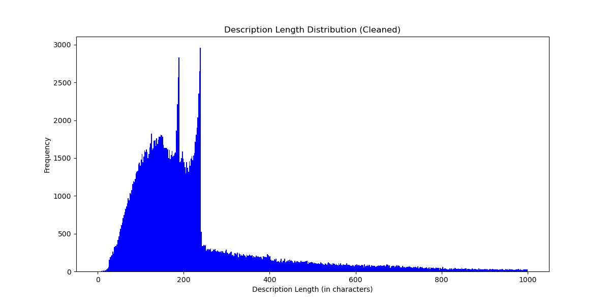

# Movie Genre Classification

This repository contains the implementation of models to classify movie genres based on their descriptions. The task is a multi-label, multi-class classification problem where a movie can belong to multiple genres.

## Dataset Creation Process

The dataset was initially sourced from **Kaggle** (link below). Since the data was divided into multiple `.csv` files by genre, these files were merged into a single dataset. After merging, data analysis and cleaning were conducted to address some detected issues. Over 70k rows had incomplete **descriptions** ("See full summary"), while an additional 50k entries were missing descriptions ("Add a plot"). Missing data was subsequently retrieved via the IMDb API and saved in `crawl_data.csv`, then merged with the original dataset and further cleaned, resulting in `clean_data.csv`. Standard preprocessing steps were then applied, and the finalized dataset was saved in **CoNLL-U** format (`conllu_data.conllu`).

## Downloading the Files

To automate the download process, run the following:
```bash
python src/download.py
```

Alternatively, create a `data/` folder manually. Inside `data/`, create a `raw/` folder, where you should copy and extract the `.csv` files downloaded from [Kaggle](https://www.kaggle.com/datasets/rajugc/imdb-movies-dataset-based-on-genre?select=history.csv).

Next, download `crawl_data.csv` (or optionally `clean_data.csv`) from the links below and place it in the `data/` folder:

| File Name           | URL                                                 | Purpose                             |
|---------------------|-----------------------------------------------------|-------------------------------------|
| crawl_data.csv      | [https://drive.google.com/uc?id=1HAARdniVyolwvwfYjhXTy5EUzd9kYSkE](https://drive.google.com/uc?id=1HAARdniVyolwvwfYjhXTy5EUzd9kYSkE) | Data crawled via the IMDb API.
| clean_data.csv      | [https://drive.google.com/uc?id=12pSL_4PxiyqGTQm8mfomHGEbB3Il1yZG](https://drive.google.com/uc?id=12pSL_4PxiyqGTQm8mfomHGEbB3Il1yZG) | Data after merging with crawled data and cleaning.
| conllu_data.conllu  | [https://drive.google.com/uc?id=1cyjpL7dXFr_2WhLIlbNPO-PyHeEZBpHI](https://drive.google.com/uc?id=1cyjpL7dXFr_2WhLIlbNPO-PyHeEZBpHI) | Preprocessed data in a CoNLL-U format.


## Folder Structure

- `src/`: Contains all scripts.
- `plot/` and `images/`: Contains generated plots from data and model analysis (`export/` folder is not pushed, contains additional plots if `run_eval()` is ran).

## Running the Code

To execute the main script, use:
```bash
python src/main.py
```

All functions are run through `main.py` and configured by the `config.json` file with the following options:

* `--tokenize`: Performs tokenization and lemmatization.
* `--preprocess`: Loads and cleans raw data.
* `--explore`: Enables data exploration (options: raw or clean).
* `--store_intermediate`: Saves intermediate files for data crawling.
* `--verbose`: Enables logging.
* `--predict`: Enables model prediction and evaluation.

## Non-Deep Learning Model(s)

### Results and Insights
We trained a multitude of different clasifiers in combination with different text modelling approaches. The goal was to find common pitfalls and patterns all classifiers are strunggling with and to determine tasks based on these insights.

First, the quantitative results are presented as an overview of the classifiers and then insights into the dataset itself are presented. Note that the models were trained on the small dev set, as computing power was a limited resources. Further, 5-fold CV was used to get predictions on all samples in the test set. 


### Quantitative results

| Classifier          | Model        | Jaccard | At least one | Precision | Recall|
|---------------------|--------------|---------|--------------|-----------| -------| 
| Logistic Regression | Word2Vec     | 0.3156  | 0.6306       | 0.5783    | 0.3406
| Logistic Regression | Bag of Words | 0.3448  | 0.6821       | 0.5540    | 0.4097 
| Logistic Regression | tf-idf       | 0.3161  | 0.6299       | 0.5951    | 0.3317 
| KNN                 | Bag of Words | 0.1848  | 0.4688       | 0.3242    | 0.250 
| KNN                 | tf-idf       | 0.2888  | 0.6197       | 0.4663    | 0.3607 
| SVM                 | Bag of Words | 0.2401  | 0.7726       | 0.4399    | 0.563 
| SVM                 | tf-idf       | ------- | -------      | -------   | -------

The results indicate that the SVM classifier has a high recall but lower precision, suggesting it is good at identifying relevant instances but also includes more false positives. Logistic Regression with Bag of Words shows a balanced performance with the highest Jaccard score among non-DL models.

## Quantitative Analysis
Further, we compared the "good" predictions with "bad" predictions based on the jaccard score. To give a better overview we include plots about the genre occurance as well as a co-occurance matrix, to give a overview of the class distribution.

<p>
  
  
</p>

Taking a look at the two plots above one can see that we tend to have some strong class imbalance towards the Drama genre. Additionally, this genre tends to occur quite often with other genres. 
We focus further analysis on the logistic regression with bag-of-words classifier, as it has the highest Jaccard score and is the best performing non-DL model, additionally it is quite interpretable.

Generally, we found that the model looks for certain distinct keywords in the plots, like "Future" in Sci-Fi. If these certain highly weighted words are present in the description, the model tends to nearly always predict this class. 

This behaviour however, is also the main pitfall of the model, as we tend to have strong overlap between genres (especially Drama) which then confuses the model. If these distinct keywords are missing, the model usually defaults back to the majority class, which is Drama. Note that we also use a "predict at least one" approach, thats why Drama is predicted most often if the model is unsure.


Lastly, there are some samples where the ground truth labels are not quite fitting, or the "border" between certain genres is not very clear. In our opinion, even humans would argue on these annotations.

### Bad examples:
Below, some wrongly predicted samples can be seen. 

* *"Victimized teenager chased by death has to make tough decisions to hide, survive and strengthen her future."*
  * **Labels**: ['Thriller']
  * **Predicted**: ['Action', 'Sci-Fi']
  * **Note**: Here, the model detects the ["future"](/images/feature_importance_Sci-Fi.png) keyword, and therefore predicting Sci-Fi.


* *"In an excavation in Saudi Arabia, professor Albert Wombot discovers an ancient object of mysterious origins, and hidden within is a powerful secret. After his discovery the professor is brutally murdered and the secret of his mysterious object seems lost forever. [...] But what Sean does not know is that Miklo's has a dark secret of his own, he is a vampire, and his journey through immortality lies in the hands of Sean and the discovery of the professors secret."*
  * **Labels**: ['Horror']
  * **Predicted**: ['Mystery']
  * **Note**: Both predictions seem reasonable, as the distinction between Horror and Mystery is subtle here. These genres often co-occur, and the keyword "mysterious" is present in the description.

* *"The adventure of a female reporter in the 1890s."*
  * **Labels**: ['Romance']
  * **Predicted**: ['Adventure']
  * **Note**: This is a good example of a very short description missing essential context, containing a single word fitting very well into another genre.

* *"Trackhouse: Get Ready chronicles the launch of one of NASCAR's newest organizations."*
  * **Labels**: ['Sport']
  * **Predicted**: ['Drama']
  * **Note**: Here, a clear keyword for sport is missing. The model then defaults to the majority class, Drama.


* *"A failed graduate student is at a loss when facing the realistic prospect. Because of all kinds of experiences, he chooses to take the postgraduate entrance examination and finally succeeds in it."*
  * **Labels**: ['Biography']
  * **Predicted**: ['Comedy', 'Romance']
  * **Note**: Again, keywords are missing. Additionally, it would be challenging even for a human to determine if it is a Biography.


### Good Examples:
* *"A pink/roman porno with a yakuza character or two."*
  * **Labels**: ['Action', 'Crime']
  * **Predicted**: ['Action', 'Crime']
  * **Note**: Here, ["yakuza"](/images/feature_importance_Crime.png) is a very strong keyword for Crime and Action. 


* *"The kidnapping and murder of an innocent child leads agents Julián Carrera ""Valentín Trujillo"" and Roberto Rojas to investigate an organization led by Antonio Farcas and the ruthless Albina who engage in organ trafficking and drugs."*
  * **Labels**: ['Action', 'Crime', 'Thriller'],
  * **Predicted**: ['Action', 'Crime', 'Thriller']
  * **Note**: Again, keywords.

### Impossible Examples

* *"The story of the highwayman and folk hero, Juraj Janosik."*
  * **Labels**: ['Animation']
  * **Predicted**: ['Drama']
  * **Note**: Just from the description its impossible to say if its an animated movie, as this is a "visual" feature. Therefore, the Animation genre will always have issues, unless its explicitly stated in the description. 

**Additionally, some ground truth labels do not seem to match the plot accurately, for example:**

* *"In 2030 during World War III, a small group of survivors make it into a bunker. Two years later, they have to exit to find new supplies but are greeted by dinosaur predators."*
  * **Labels**: ['Adventure', 'Sci-Fi']
  * **Predicted**: ['Drama']
  * **Note**: It is strange that keywords like "War", "survivors", and "bunker" did not trigger the war classifier. Additionally, it was not even labeled as War to begin with.


### Supportive Plots
In the plot below, one can see that there is a correlation between the average jaccard score and the amount of samples per label. This shows that the class imbalance has a strong effect on the performance.
<p>
  
</p>

Also, please refer to the feature importance plots in the [images](/images) folder. These are the words scaled by the repective learned weights of the logistic regression classifier.

## Deep Learning Model

### Model Architecture
We utilized **DistilBERT**, a distilled and compact version of BERT, as the backbone for this task. DistilBERT was chosen for its:  
- Faster training and inference times compared to BERT.  
- Compact size while retaining a significant portion of BERT’s performance.

### Key Strategies

1. **Ensuring Predictions for All Movies:**  
   - Implemented logic to ensure at least one genre is predicted for each movie by assigning the genre with the highest probability when no positive class is predicted.

2. **Addressing Class Imbalance:**  
   - **Class Weights**: Used `np.log(total_samples / (class_counts + 1))`, normalized by their mean, in conjunction with ***BCEWithLogitsLoss***.
   - **Focal Loss:** Incorporated to focus on underrepresented genres, achieving the best validation performance. Constants `alpha` and `gamma` were set to **0.375** and **2.00**, respectively.
   - **Oversampling:** Opportunity to explore oversampling techniques like **SMOTE** to address class imbalance for Milestone 3.  

   While these techniques did not dramatically increase the overall performance of the model, they were effective in improving predictions for low-support classes such as *Music*, *Musical*, *Sport*, *Film-Noir*, and *Western* which can be seen in the [classificaiton report graphs](#classification-report-graph-original-vs-bce) (with original model being the top one, BCE below).

3. **Training:**  
   - All models were trained for 3 epochs on a smaller development dataset of ~17k rows (0.8/0.1/0.1 split).  
   - Achieved a Jaccard score of approximately **0.43**.  

---

### Combined Metrics

|     **Metric**      | **Original** | **Focal Loss** | **Log Weighted BCE** | **LogReg** |
|:-------------------:|:--------------:|:----------------:|:----------------------:|:---------:|
| **Jaccard**           | 0.42         | 0.44           | 0.43                 | 0.35      |
| **Hamming Loss**      | 0.09         | 0.09           | 0.09                 | 0.10      |
| **Accuracy**          | 0.14         | 0.15           | 0.14                 |  ----         |
| **F1-Score**          | 0.52         | 0.54           | 0.54                 | 0.48      |
| **Precision**         | 0.63         | 0.63           | 0.58                 | 0.55      |
| **Recall**            | 0.50         | 0.53           | 0.56                 | 0.42      |
| **At Least One**      | 0.80         | 0.81           | 0.83                 | 0.69      |
| **At Least Two**      | 0.25         | 0.28           | 0.33                 | 0.16      |

---

### Classification report graph (Original vs BCE)


---
### Micro, Macro, Weighted, and Samples Average

| Precision       | Original | Focal Loss | BCE Log |
|---------------- |----------|------------|---------|
| **Micro Avg**   | 0.61     | 0.61       | 0.55    |
| **Macro Avg**   | 0.49     | 0.53       | 0.49    |
| **Weighted Avg**| 0.58     | 0.59       | 0.55    |
| **Samples Avg** | 0.63     | 0.63       | 0.58    |

| Recall          | Original | Focal Loss | BCE Log |
|---------------- |----------|------------|---------|
| **Micro Avg**   | 0.47     | 0.50       | 0.54    |
| **Macro Avg**   | 0.30     | 0.37       | 0.47    |
| **Weighted Avg**| 0.47     | 0.50       | 0.54    |
| **Samples Avg** | 0.50     | 0.52       | 0.56    |

---

### Performance Summary

- **Precision** is higher in the **Original** and **Focal Loss** models, as they focus more on reducing false positives, especially in larger, more balanced genres. **Focal Loss** further boosts precision by prioritizing harder-to-classify examples.

- **Recall** is better in the **BCE Log** model due to the class weights it applies, which help it focus on underrepresented genres. This allows it to capture more true positives, especially in low-support genres like **Film-Noir**.

### Genre-Specific Notes
Genres like **Film-Noir** have low support (while also co-occuring with majority classes), which leads to challenges in classifying them. **BCE Log** improves recall for these genres by applying class weights, though at the cost of precision (precision and recall are more balanced), which we can see in the [first set of heat maps](#low-support-genres) and also in the [classification report comparison](#classification-report-graph-original-vs-bce). The **Original** and **Focal Loss** models perform better for larger genres with more balanced classes, can be observed in the [second set of heat maps](#high-support-genres).

**Animation** and **Biography** have high precision but low recall due to class imbalance and reliance on specific keywords ("animated" for Animation, "biopic" for Biography). These genres are underrepresented, leading to the model being highly selective, resulting in fewer false positives but missing many true examples (low recall). In contrast, **Drama**, with larger support and more varied examples, benefits from label co-occurrence and overlaps with other genres, resulting in higher recall, though at the cost of lower precision. However, due to the complexity of deep learning models, other factors may also contribute.

<h3 id="low-support-genres">Performance Heatmap for Low-Support Genres </h3>


Recall dramatically higher in **BCE Log** model for low-support genres, while Focal loss keeps up in both precision and recall.

<h3 id="high-support-genres">Performance Heatmap for High-Support Genres </h3>


Differences between **BCE** and other loss functions in precision and recall are less pronounced in high-support genres, with **Original** and **Focal Loss** models performing better.

---

### Comparison with Logistic Regression


From the graphs above it seems the DL model performs better in higher support genres (e.g., Horror, Crime, Drama) because it excels
at capturing complex patterns and relationships from larger datasets, enabling better generalization.
In contrast, lower support genres (e.g., Animation, Biography, Mystery) struggle in the DL model likely due
to its need for more data to avoid overfitting, whereas logistic regression benefits from simpler
keyword-based features that perform well with small datasets.
For the War genre, even with limited data, the DL model seems to handle it better, likely due to its ability to capture the complex relationships in the genre’s themes.
## Qualitative Analysis

<!-- Examples of similiar predictions as logistic regression
story ned kelly

Examples of different (better) precitions on the same movie
war example

Other examples where the model did bad

Examples where the model did much better (accordig do jaccard score) -->

### Bad examples:

#### Common Issues of the DL Compared to Logistic Regression (Keyword Reliance and Drama Majority Bias)  
* *"A poor but big-hearted man takes orphans into his home. After discovering his scientist father's invisibility device, he rises to the occasion and fights to save his children and all of India from the clutches of a megalomaniac."*  
  * **Labels**: ['Action', 'Comedy', 'Drama']  
  * **Predicted**: ['Family']  

* *"A hobo (Julio Alemán) is given the power to know what will happen in the future, but only for 24 hours."*  
  * **Labels**: ['Drama', 'Fantasy']  
  * **Predicted**: ['Sci-Fi']  

* *"A man travels through Asia and Africa seeking the treasure of Ali Baba."*  
  * **Labels**: ['Action']  
  * **Predicted**: ['Adventure']  
* **Note**: The model appears to rely heavily on isolated keywords, such as "children" (Family), "future" (Sci-Fi), and "travels" (Adventure), while overlooking the broader context.

---

* *"The story of Eugenio, young soldier of the Napoleonic army, in the Napoli of 1815 after the era of Gioacchino Murat."*  
   * **Labels**: ['History']  
   * **Predicted**: ['Drama', 'History']  

* *"Transylvania in the Autumn of 1944, soon after Romania turned against Nazi Germany, a joint Soviet-Romanian commando group is sent across enemy lines with a mission to prevent the destruction of a strategic mountain tunnel by German troops."*  
   * **Labels**: ['War']  
   * **Predicted**: ['Drama', 'War']  

* **Note**: Both examples illustrate the model's tendency to overemphasize Drama due to its majority class status, despite the clear historical and war-specific contexts.

---

### Additional Genres Misclassified  

#### **Horror Misclassification**  

* *"The ghost of a dead porn star comes to Earth to help a nerd with his sex life."*  
  * **Labels**: ['Comedy', 'Fantasy', 'Romance']  
  * **Predicted**: ['Horror']  
  * **Note**: The word "ghost" misleads the model into choosing Horror, despite the lighthearted and comedic context.  

* *"A man suspects his wife of adultery and goes on a killing spree, eliminating all he believes are sleeping with her, but his victims don't stay dead."*  
  * **Labels**: ['Horror']  
  * **Predicted**: ['Crime', 'Drama', 'Thriller']  
  * **Note**: The absence of direct Horror keywords likely leads to misclassification into suspense-based and high-support genres.  

#### **Comedy Misclassification**  

* *"After driving too fast, A6262 jumps from the year 2037 back 50 years to 1987, where she meets and charms chocolate factory owner Fong."*  
  * **Labels**: ['Romance', 'Sci-Fi']  
  * **Predicted**: ['Comedy']  
  * **Note**: The quirky premise (chocalate factory) probably causes the model to overfit to Comedy, despite Romance and Sci-Fi being more prominent.  

* *"Cute Katya starts as a window dresser at a Pittsburgh department store. She dates a reporter. A fan stalks her and is increasingly nasty."*  
  * **Labels**: ['Thriller']  
  * **Predicted**: ['Comedy']  
  * **Note**: Misclassification arises from a lack of explicit suspense cues in the description, and Comedy's high support exacerbates the issue.  

The **Horror** genre, despite not being the most major class, performs well due to its distinct features. However, the model often mislabels it, relying on keywords like "ghost" or "killing" that overlap with other genres. This shows the model's effectiveness in identifying **Horror** but also its struggle with nuanced contexts where such keywords are present but do not define the genre.

The **Comedy** genre's broad nature leads to frequent misclassifications. The model struggles with subtle nuances, often confusing Comedy with **Romance** or **Family** if humor isn't explicit. Overlaps with genres like **Drama** or **Romance** further complicate predictions, indicating a need for better feature extraction and context understanding.

---

### Good examples:  

Here we chose examples based on the difference of scores between Logistic regression and the DL model.

* *"Inheriting a dry patch of land, Bancharam converts it into a fabulous garden."*  
  * **Labels**: ['Fantasy']  
  * **Predicted**: ['Fantasy']  
  * **Lreg**: ['Adventure']
  * **Note**: The model correctly aligns the whimsical transformation with the Fantasy genre.  

* *"After his father is killed, King Valemon ascends the throne, only to be turned into a polar bear by a bitter witch who wants to be his queen. Valemon must find a bride in the seven-year span that he'll be a polar bear, ..."*  
  * **Labels**: ['Adventure', 'Family', 'Fantasy']  
  * **Predicted**: ['Adventure', 'Family', 'Fantasy']  
  * **Lreg**: ['Horror']
  * **Note**: The DL model effectively captures the blend of genres due to the rich and explicit narrative.  

* *"Several animated stories from 'Metamorphoses,' Roman poet Ovid's narrative of legends, are presented."*  
  * **Labels**: ['Animation', 'Fantasy']  
  * **Predicted**: ['Animation', 'Fantasy']  
   * **Lreg**: ['Comedy']
  * **Note**: Correctly identifies the artistic and fantastical focus, avoiding overfitting to high-support genres like Comedy.  


* *"In 2030 during World War III in which a small group of survivors make it into a bunker. Two years later they have to exit to find new supplies, but they are greeted by dinosaur predators."*  
   * **Labels**: ['Sci-Fi', 'Adventure']  
   * **Predicted**: ['Sci-Fi']  
   * **Lreg**: ['Drama']
   * **Note**: The DL model correctly identifies the Sci-Fi genre due to the futuristic and survival elements (adventure being almost picked with the second highest prob).

---

### Impossible Cases  

* *"An adaptation of the homonym Pere Calders' work, a history full of other histories, centered in the reunion of his protagonist's first love."*  
  * **Labels**: ['Horror']  
  * **Predicted**: ['Drama', 'Romance']  
  * **Note**: The title ("La Veritat Oculta") is crucial context here; without it, the prediction is understandably incorrect.  

* *"Lance Hayward, a silent movie star, appears as various characters, killing quite a handful of unfortunates, using various weapons."*  
  * **Labels**: ['Horror']
  * **Predicted**: ['Action'] 
  * **Note**: The title ("Terror Night") would provide the missing Horror signal.  

---  

These examples highlight model strengths in handling explicit genre cues but also its overreliance on single keywords or majority class bias when context is insufficient.

## Description Length Analysis

### Distribution of Description Lengths


With **mean being ~240** and **median ~181**, the distribution is right-skewed, with a few outliers having descriptions over 1000 characters. The majority of descriptions fall within **100-300** characters (interquantile range is (124, 237)), maximum length is 9733. Removing outliers and truncating descriptions to a reasonable length could improve model performance.


The graph above shows the Jaccard scores for the **DL model** across different input text lengths. Similar trends were observed for KNN with Bag-of-Words (BOW) and TF-IDF Vectorizer, as well as Logistic Regression with BOW + TF-IDF, where performance increased after a certain text length. However, models using CountVectorizer did not exhibit this improvement, indicating that CountVectorizer may struggle to capture patterns in longer texts compared to other vectorization techniques. See [more graphs](images/metrics_per_length/).

Performance peaks at **250–450** characters, likely because this range provides sufficient information **without introducing noise**. Interestingly, performance rises again around **700+** characters, possibly because longer descriptions contain **additional context** that helps the model make better predictions despite earlier noise.

## Summary of Findings
While the DL model performs better overall, it is still heavily influenced by class imbalances, primarily due to the prevalence of the Drama genre. This bias towards Drama affects the model's predictions, often leading to misclassifications. Many of the DL model's behaviors can be explained by the feature importances observed in the logistic regression model. For instance, keywords that are highly indicative of certain genres in logistic regression also tend to dominate the DL model's predictions, highlighting the need for more balanced training data and advanced techniques to mitigate class imbalance effects.

We also tested on a bigger dataset (~19k rows compared to the smaller ~1.7k rows, see the [metrics graph](images/metrics_per_genre_big_dataset.png)), and the results were similar. However, the **Animation** and **Biography** genres performed much better in terms of precision (+0.25 and +0.15 respectively). This improvement is likely due to the increased amount of data, which allowed the model to encounter the keywords "animation" and "biopic/bio" more frequently.

## Potential tasks for Milestone 3
<!-- smote https://datascience.stackexchange.com/questions/27671/how-do-you-apply-smote-on-text-classification
remove gibbreish descs
remove too long/ too short descs
remove common keywords for different genres so the model learns deeper stuff -->

1. **Apply SMOTE:** Balance class distributions by generating synthetic samples for underrepresented classes as proposed [here](https://datascience.stackexchange.com/questions/27671/how-do-you-apply-smote-on-text-classification) or after vectorizing the text data (e.g., TF-IDF or embeddings).

2. **Remove gibberish descriptions:** Filter out nonsensical or noisy data that adds no meaningful signal.

3. **Filter lengthy/short descriptions:** Remove descriptions that are too short (lack context) or too long (add irrelevant details). See [description length analysis](#description-length-analysis).

<!-- Truncating overly long texts or
Summarizing lengthy inputs
might help eliminate noise and improve performance for problematic ranges. -->

4. **Remove common keywords:** Eliminate generic words (e.g., "movie," "story") shared across genres to encourage the model to learn deeper semantic patterns (see [wordclouds](plots/) and [feature importance graphs](images/)).


# Milestone 3

## Addressing Class Imbalance

### Removing the 'Drama' genre

To address the class imbalance issue, we experimented with removing the **Drama** genre from the dataset. The **Drama** genre is the most prevalent in the dataset, and its dominance could lead to biases in the model's predictions. By removing **Drama**, we aimed to reduce the model's reliance on this genre and improve predictions for other genres. Drama had no single label ground truths, only co-occurred with other genres, so the size of the dataset remained the same.

The following metrics are based on the full dataset (with just Drama removed).

### Results

|     **Metric**      | **Original** | **No Drama** |
|:-------------------:|:--------------:|:------------:|
| **Jaccard**           | 0.42         | 0.43         |
| **Hamming Loss**      | 0.09         | 0.07         |
| **Accuracy**          | 0.14         | 0.22         |
| **Precision**         | 0.62         | 0.60         |
| **Recall**            | 0.50         | 0.48         |
| **At Least One**      | 0.79         | 0.68         |
| **At Least Two**      | 0.24         | 0.09         |

### Analysis


<!-- - **Precision and Recall:** Both precision and recall decreased slightly, but the model maintained a good balance between the two metrics.
- **At Least One and At Least Two:** The model's performance for predicting at least one and at least two genres decreased after removing 'Drama', indicating that the model may have become less confident in its predictions. -->

- **Jaccard Score**: A slight increase from 0.42 to 0.43 suggests improved alignment between predictions and true labels, likely because removing Drama reduces overgeneralization caused by its dominance.

- **Hamming Loss**: The Hamming loss decreased, suggesting that the model made fewer incorrect predictions.

- **Accuracy**: A notable increase from 0.14 to 0.22 reflects improved exact match accuracy for the predictions. Removing Drama likely allows the model to focus on other genres more effectively.

- **Precision**: The slight decrease from 0.63 to 0.60 could mean the model is less selective without Drama, leading to slightly more false positives.

- **Recall**: The decrease from 0.50 to 0.48 suggests the model might miss some true positives in less-prevalent genres without the general fallback of Drama.

- **"At Least One" and "At Least Two"**: The sharp decline in these metrics highlights that Drama’s removal significantly impacts predictions where the model is unsure, revealing how heavily the model relied on Drama as a "fallback" genre.

### Genre-Specific Analysis

Since very low-support genres (see the [distribution graph](images/genre_distribution.png)) like **Music, Musical, Sport, Film-Noir and Western** achieved zero true positives, we are not showing them in the graphs. We also decided that the genre **Comedy** is not intersting for us, since like **Drama** it co-occurs with a lot of other genres, is common in the dataset and is very general. Also like Drama it has no single-label ground truths (only co-occurs with other genres).

The next step is to train the model on a smaller dataset with the genres in question removed to see if the model's performance improves further. However, as for the metrics above, also the graphs below show performance for the full dataset (with just Drama removed).

<div id="dl_diff">
  
</div>

<div>
  
</div>

The graphs reveals some interesting results, for example low-support genres like **Biography, History, War** and **Animation** all saw a big impact on their performnace, where only only **Animation** saw a decrease in both precison (altought pretty small) and recall. On the other hand higher-support genres like **Action, Crime** or **Romance** saw a more conservative difference in metrics.
Overall precision decreased significantly while recall increased.

#### Possible reasons behind the precision/recall changes
The absence of **Drama** redistributes the model's focus to less dominant genres, enhancing recall for those labels, but at the cost of more frequent misclassifications. 
In other words, the model compensates by predicting other genres more liberally, capturing more true positives and increasing recall which goes hand in hand with more false positivies, thus decreasing precision. 
Additionally, the **Drama** label could have acted as a strong signal to help the model distinguish between genres that overlap with it and those that don't. Removing this signal may have led to more incorrect predictions (false positives), further lowering precision.

In the next chapter we will try to further analyse and find reasons for these changes.

### Reasons for Changes in Performance Metrics
This chapter investigates the impact of removing the Drama label on model performance metrics by analyzing genre co-occurrence patterns and feature contributions. 

**Hypothesis**: Low co-occurence genres that share common keywords/feature importances with Drama will see the biggest increase in performance.


<div id="drama_cooccurence_matrix">
  
</div>


The occurence above is **normalized** by the total occurence of each genre column-wise. The highlighted row shows relative co-occurence of genres (columns) with Drama (row).

Reading the heatmap we can see that genres that have a **High co-occurence** with drama and are silmultaneously [**Low-support**](images/genre_distribution.png) (**War, History, Biography**) saw the biggest jump in performance. On the other hand **Animation** (also low-support), a genre with the lowest co-occurence with Drama, saw an overall worst decrease in performance out of all the genres (when comparing by Jaccard Score diff., altough the diff. in precision/recall is modest). 

Romance saw the biggest impact from the higher-support genres, while having the highest co-occurence with Drama. Romance is also interesting in a sense that apart from Drama it does not co-occur much with other genres, which could explain the bigger impact on performance.

Overall we can see that both the support (inversely) of a genre and its co-occurence with Drama play a role in its preformance. Which makes sense, since low-support and high co-occurence genres saw the biggest performance changes, while high-support genres with lower co-occurence with Drama saw a more conservative change in performance.

### Changes in Metric for the Logistic Regression Model

The logistic regression model was also evaluated on the dataset with the Drama label removed to compare the performance differences with the DL model.

#### CountVectorizer model

<div>
  
</div>

<div>
  
</div>

#### TfidfVectorizer model

<div>
  
</div>

<div id="logreg_tfidf_diff">
  
</div>

The distribution of the metric differences seems to be the similiar to the **DL model**, while the **CountVectorizer** seems to be more uniform across all genres and **TfidfVectorizer** more extreme in its changes (the differences in precison/recall are bigger in magnitude). Also worth mentioning is the fact that the Jaccard score differences are only positive for the **LogReg** model, while the [**DL model**](#dl_diff) saw a decrease in Jaccard score for some genres. Another interesting fact is that only the **History** genre saw an increase in both recall and precision (**TfidfVectorizer** model).

The **TfidfVectorizer** shows more extreme differences because it emphasizes unique terms, amplifying genre-specific variations, while the **CountVectorizer** produces more uniform results by treating all terms equally. Jaccard score differences after removing Drama decrease for genres like **Animation**, which rarely [co-occur with Drama](#drama_cooccurence_matrix), and **Mystery**, where feature importance vectors [differ significantly](#second_row) in magnitude. Despite these changes, the order of Jaccard score differences remains similar across all models, reflecting consistent relative difficulty among genres.

<!-- while the CountVectorizer model saw a bigger decrease in precision and recall for the low-support genres, the TfidfVectorizer model saw a bigger decrease in precision and recall for the high-support genres. This could be due to the fact that the CountVectorizer model is more prone to overfitting, while the TfidfVectorizer model is more robust to overfitting. -->

### Feature Importance Analysis

To further understand the changes in performance metrics, we analyzed the feature importances of the logistic regression model. The feature importances provide insights into the model's decision-making process and can help identify common keywords that influence genre predictions.

<table align="center" id="first_row">
<td align="center">

<h4><center>Number of top 500 Features shared between Drama and other Genres</center></h4>
<hr></hr>

| Genre      | Relative # of Shared Features |
|:----------:|:-----------------------------:|
| Crime      | 0.046                         |
| Biography  | 0.041                         |
| War        | 0.038                         |
| History    | 0.035                         |
| Mystery    | 0.034                         |
| Romance    | 0.034                         |
| Action     | 0.021                         |
| Family     | 0.021                         |
| Fantasy    | 0.020                         |
| Thriller   | 0.017                         |
| Adventure  | 0.016                         |
| Sci-Fi     | 0.015                         |
| Horror     | 0.011                         |
| Animation  | 0.010                         |

</td>
<td align="center">

<h4><center>Cosine Similarity between full Feature Importance vectors of Drama and other Genres</center></h4>
<hr></hr>

| Genre      | Cosine Similarity |
|:----------:|:-----------------:|
| Crime      | 0.095             |
| Romance    | 0.081             |
| War        | 0.073             |
| Biography  | 0.070             |
| History    | 0.067             |
| Mystery    | 0.027             |
| Family     | -0.025            |
| Fantasy    | -0.040            |
| Sci-Fi     | -0.054            |
| Action     | -0.070            |
| Thriller   | -0.073            |
| Adventure  | -0.079            |
| Animation  | -0.087            |
| Horror     | -0.152            |

</td>
</table>

<h4><center>Similiarity between top 100 + worst 100 features of each genre against Drama</center></h4>
<table align="center" id="second_row">
<tr></tr>
<td>

| Genre      | Cosine Similarity |
|:----------:|:-----------------:|
| War        | 0.36              |
| Biography  | 0.35              |
| History    | 0.32              |
| Crime      | 0.30              |
| Romance    | 0.21              |
| Family     | -0.02             |
| Adventure  | -0.03             |
| Mystery    | -0.10             |
| Sci-Fi     | -0.13             |
| Fantasy    | -0.17             |
| Thriller   | -0.20             |
| Animation  | -0.25             |
| Action     | -0.26             |
| Horror     | -0.52             |

</td>
<td>

| Genre      | Euclidean Distance |
|:----------:|:------------------:|
| Biography  | 6.957              |
| War        | 7.432              |
| Crime      | 7.834              |
| History    | 8.485              |
| Sci-Fi     | 8.912              |
| Animation  | 8.971              |
| Family     | 9.203              |
| Romance    | 9.269              |
| Thriller   | 9.857              |
| Fantasy    | 9.921              |
| Adventure  | 10.027             |
| Action     | 10.077             |
| Mystery    | 10.528             |
| Horror     | 10.930             |

</td>
</tr>
</table>

The [fisrt row of tables](#first_row) shows the **relative number of shared features** between Drama and other genres, as well as the **cosine similarity** between their **full feature importance vectors** (full vocab. of ~32k words).  

The [second row of tables](#second_row) shows the **cosine similarity** between the top 100 and worst 100 features of each genre against Drama, as well as the **Euclidean distance** between them. The **magnitudes** of the feature importances were **normalized** between 1 and -1 using the formula $\mathbf{\frac{X - min(X)}{max(X) - min(X)}}$ for the positive features and $\mathbf{-\frac{X - max(X)}{min(X) - max(X)}}$ for the negative features. The top 100 and worst 100 features were chosen based on their importance values. "Top" features are those with the highest positive importance values, while "worst" features are those with the highest negative importance values. So the top 100 features are the most important features for the model to choose the given genre, while the worst 100 features are the most important features for the genre not to be chosen.

We thought **Euclidean distance** could provide some additional insights, since the magnitude of the feature importance vectors could also be relevant, e.g. when a feature has a higher importance number it probably means its more imporant to the decision boundary of the genre. 

#### Conlusion

The case of **Mystery** is particularly interesting. It exhibits the second-highest Euclidean distance from Drama, which may explain the slight drop in performance observed when Drama is removed. Otherwise the tables align with the insights from the co-occurrence heatmap.

We also tried L2 normalization of the feature importance vectors and other approaches, yielding similar results. Although the feature importances are derived from the logistic regression model, they are also relevant to the deep learning model, as their [performance distribution](images/metrics_per_genre_distribution.svg) is similar. 

<!-- The results show that genres with higher cosine similarity and lower Euclidean distance to Drama have more overlapping signals, potentially leading to more misclassifications after Drama's removal. For example, **War, Biography, and History** have high cosine similarity and low Euclidean distance to Drama, indicating significant feature overlap. This overlap could explain the increase in recall for these genres after Drama's removal, as the model can better identify them without Drama's dominant signals. On the other hand, **Animation** has low cosine similarity and high Euclidean distance to Drama, suggesting distinct features with little overlap. This lack of overlap could explain the decrease in recall for Animation, as the altered decision boundaries may lead to misclassification or deprioritization. The results underline the need for strategies to address class imbalance and improve contextual understanding without relying on dominant genres.  -->


<!-- The cosine similarity and Euclidean distance between feature importance vectors can provide insights into the model's decision-making process. Genres with higher cosine similarity and lower Euclidean distance to Drama may have more overlapping signals, potentially leading to more misclassifications after Drama's removal. -->

### TF-IDF Vector Comparison

To further investigate the impact of removing Drama on the model's predictions, we compared the **TF-IDF vectors** of the descriptions for each genre. The TF-IDF vectors provide insights into the unique features that distinguish each genre and how they differ from Drama.

<table align="center">
<tr>
<td align="center">

#### TF-IDF sublinear_tf=True AVG top 100
<hr></hr>

| Genre      | Cosine Similarity |
|:----------:|:-----------------:|
| Thriller   | 0.9847            |
| Romance    | 0.9826            |
| Action     | 0.9727            |
| Family     | 0.9718            |
| Fantasy    | 0.9716            |
| Adventure  | 0.9702            |
| Crime      | 0.9628            |
| Mystery    | 0.9589            |
| Horror     | 0.9574            |
| Animation  | 0.9244            |
| History    | 0.9182            |
| Sci-Fi     | 0.8987            |
| Biography  | 0.8965            |
| War        | 0.8299            |

</td>
<td align="center">

#### TF-IDF sublinear_tf=True SUPERDOC top 100
<hr></hr>


| Genre      | Cosine Similarity |
|:----------:|:-----------------:|
| History    | 0.8818            |
| Crime      | 0.8645            |
| War        | 0.8452            |
| Biography  | 0.8096            |
| Family     | 0.7979            |
| Sci-Fi     | 0.7844            |
| Thriller   | 0.7277            |
| Action     | 0.7270            |
| Mystery    | 0.7162            |
| Romance    | 0.7060            |
| Fantasy    | 0.6719            |
| Adventure  | 0.6530            |
| Horror     | 0.6279            |
| Animation  | 0.5010            |

</td>
</tr>
</table>

<!-- Two approaches were used to compare the TF-IDF vectors:
superdocument fo each genre
avg. tf-idf vector for each genre

furthermore, the highest 100 TF-IDF trems were used for the comparison. Similiarly to the feature importance analysis, the cosine similarity was used to compare the vectors. Highest 100 of TF-IDF terms of each genre were compared to the tf-idf of the same terms of the Drama genre.

Sublinear TF scaling formula $\mathbf{1 + log(TF)}$ was used for the TF-IDF vectorization. It is a common approach to reduce the impact of very frequent words in the dataset. TfidfVectorizer has a setting sublinear_tf=True, which applies this formula to the term frequency part of the TF-IDF calculation.


CounVectorizer L2 normalised (TfidfVectorizer L2 normalises bey default) was also tried, but the results were similar.
many other setting were tried, but the results were similar.

History in th second table is an outlier out of all the settings, showing the highest cosine similarity to Drama. This could be due to the genre's historical context, which may share common keywords with Drama. 

#### Conlusion

Both TF-IDF and Feature Importance show that the numbers confirm the observations we made previously using the Drama co-occurence heatmap and support distribution. The impact on performance is impacted by both these factors. This also translaets to the TF-IDF and Feature importance comparrsion, where the tables show that both of these are some combination of the former. -->

Two approaches were employed to compare the TF-IDF vectors:  
1. **Superdocument for each genre**: A single combined document representing all text from a genre (SUPERDOC).  
2. **Average TF-IDF vector for each genre**: The mean TF-IDF vector across all documents in the genre (AVG).  

The top 100 TF-IDF terms were selected for comparison. Similar to the feature importance analysis, cosine similarity was used to compare these vectors. Specifically, the top 100 TF-IDF terms for each genre were compared to their corresponding values in the Drama genre.  

Sublinear TF scaling, using the formula $\mathbf{1 + \log(TF)}$, was applied for TF-IDF vectorization. This common technique reduces the impact of extremely frequent terms within the dataset. The `TfidfVectorizer` implementation automatically supports this approach when the `sublinear_tf=True` parameter is set.  

For comparison, `CountVectorizer` with L2 normalization (to mirror TfidfVectorizer’s default normalization) was also tested. However, the results remained consistent across both methods. Similarly, numerous parameter variations were explored, had various effect on the outcomes (however the order remained consistent). The SUPERDOC top 100 with sublinear TF scaling was the most outlying config.

#### Observations

The **History** genre emerges as an outlier across all configurations, displaying the highest cosine similarity to Drama. This may be attributed to shared thematic or linguistic elements, such as historical context and terminology, which overlap significantly with Drama. This could explain why the Logistic Regression with TF-IDF model have shown an increase in both precison and recall only for the History genre after Drama's removal ([see here](#logreg_tfidf_diff)).

#### Conclusion

The results of both TF-IDF and feature importance analyses align closely with previous insights derived from the Drama co-occurrence heatmap and support distribution. These findings confirm that the impact on performance is influenced by a combination of these factors. This relationship is further corroborated by the TF-IDF and feature importance comparisons, where the data highlights their interconnected nature.  
 
<!-- ### SHAP values

To further understand the DL model's decision-making process, we used SHAP (SHapley Additive exPlanations) values to analyze the impact of individual features on the model's predictions. SHAP values provide insights into how each feature contributes to the model's output, helping identify the most influential keywords for each genre also for the DL model. -->

<div>
  
</div>

<!-- The superdocument approach concatenates all descriptions for a given genre into a single document, while the average approach calculates the average TF-IDF vector for each genre. The superdocument approach provides a comprehensive overview of the genre's unique features, while the average approach offers a more generalized representation. -->

<!-- The results show that genres with higher cosine similarity to Drama in the TF-IDF vectors have more overlapping signals, potentially leading to more misclassifications after Drama's removal. For example, **Thriller, Romance, and Action** have high cosine similarity to Drama, indicating significant feature overlap. This overlap could explain the decrease in precision for these genres after Drama's removal, as the model may struggle to distinguish them from Drama. On the other hand, **War, Biography, and History** have lower cosine similarity to Drama, suggesting distinct features with little overlap. This lack of overlap could explain the increase in recall for these genres after Drama's removal, as the model can better identify them without Drama's dominant signals. The results underline the need for strategies to address class imbalance and improve contextual understanding without relying on dominant genres. -->

are the logreg weigths normalized?
are the tf-idf vectors normalized by default?

real co-occurence from predictions
keywords specific to differntiate drama and other genres
SHAP
graphs for logreg [done] tables for feature importance maybe
tf-idf comparison [done]
logreg balanced weights
logreg normalized tf-idf
<!-- #### **Low-Support Genres**

Low-support genres saw a big jump in performance, where genres that have a high co-occurence with drama (**War, History, Biography**) saw a significant increase in performance (precision slightly down, recall significantly up). On the other hand **Animation**, with relatively low co-occurence with Drama, saw an overall worst decrease in performance out of all the genres (recall dramatically down, precison up). 

<!-- This is likely due to the model not defaulting to Drama when unsure, and instead making more accurate predictions for these genres.


| Genre | Precision diff. | Recall diff. | Drama co-occurence |
|:-------:|:-----------:|:--------:|:--------------------:|
| War   | -0.07      | +0.19   | 0.68               |
| History | -0.03    | +0.07   | 0.69               |
| Biography | -0.07  | +0.13   | 0.64               |
| Animation | +0.13  | -0.08   | 0.12               |

War, History and Biography overlap significantly with Drama, so removing Drama shifts the model’s focus to their unique features. This results in increased recall, as the model better identifies these genres without Drama dominating shared signals, but decreased precision due to over-prediction and more false positives.

Animation has distinct features with little overlap with Drama, but Drama’s removal still indirectly affects it. Recall decreases as the altered decision boundaries may lead to misclassification or deprioritization, while precision increases as the model becomes more conservative, reducing false positives but missing true positives.

### Conclusion:
The removal of Drama improves label-specific performance and reduces bias but challenges the model's ability to handle multi-label predictions, particularly for genres that co-occur with Drama.  -->
<!-- These results underline the need for strategies to address class imbalance and improve contextual understanding without relying on dominant genres. -->


<!-- | Genre      | Cosine Similarity |
|:----------:|:-----------------:|
| Crime      | 0.89              |
| Romance    | 0.78              |
| War        | 0.73              |
| Biography  | 0.70              |
| History    | 0.68              |
| Mystery    | 0.39              |
| Family     | -0.00             |
| Fantasy    | -0.11             |
| Sci-Fi     | -0.22             |
| Action     | -0.34             |
| Thriller   | -0.35             |
| Adventure  | -0.40             |
| Animation  | -0.46             |
| Horror     | -0.94             | -->


<!-- #### Cosine similiarity between top 100 + worst 100 features of each genre against Drama
War: 0.36
Biography: 0.35
History: 0.32
Crime: 0.30
Romance: 0.21
Family: -0.02
Adventure: -0.03
Mystery: -0.10
Sci-Fi: -0.13
Fantasy: -0.17
Thriller: -0.20
Animation: -0.25
Action: -0.26
Horror: -0.52

#### Euclidean distance between top 100 + worst 100 features of each genre against Drama
Biography: 6.957
War: 7.432
Crime: 7.834
History: 8.485
Sci-Fi: 8.912
Animation: 8.971
Family: 9.203
Romance: 9.269
Thriller: 9.857
Fantasy: 9.921
Adventure: 10.027
Action: 10.077
Mystery: 10.528
Horror: 10.930 -->

<!-- | Genre      | Relative # of Shared Features |
|:----------:|:-----------------------------:|
| Crime      | 0.046                         |
| Biography  | 0.041                         |
| War        | 0.038                         |
| History    | 0.035                         |
| Mystery    | 0.034                         |
| Romance    | 0.034                         |
| Action     | 0.021                         |
| Family     | 0.021                         |
| Fantasy    | 0.020                         |
| Thriller   | 0.017                         |
| Adventure  | 0.016                         |
| Sci-Fi     | 0.015                         |
| Horror     | 0.011                         |
| Animation  | 0.010                         | -->

<!-- | Genre      | Cosine Similarity |
|:----------:|:-----------------:|
| Crime      | 0.89              |
| Romance    | 0.78              |
| War        | 0.73              |
| Biography  | 0.70              |
| History    | 0.68              |
| Mystery    | 0.39              |
| Family     | -0.00             |
| Fantasy    | -0.11             |
| Sci-Fi     | -0.22             |
| Action     | -0.34             |
| Thriller   | -0.35             |
| Adventure  | -0.40             |
| Animation  | -0.46             |
| Horror     | -0.94             | -->